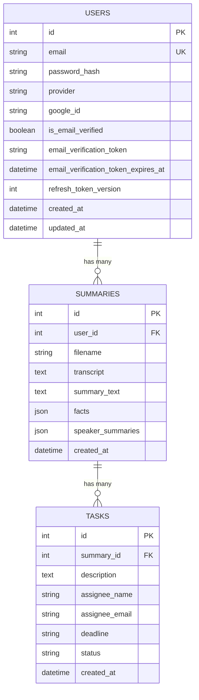

# 🔧 Darwin — Technical Requirements Document (TRD)

**Version:** 1.0  
**Date:** March 13, 2026  
**Author:** Prathmesh R.  
**Status:** Active

---

## 1. System Overview

Darwin is an AI-powered meeting intelligence platform built on a **decoupled client-server architecture**. The backend is a Python-based **FastAPI** asynchronous web server, while the frontend is a **React + TypeScript** single-page application bundled via **Vite**. The system integrates with external AI services (AssemblyAI, Google Gemini) and communicates via REST APIs and WebSockets.

---

## 2. High-Level Architecture

```
┌─────────────────────────────────────────────────────────────┐
│                     FRONTEND (React + TS)                    │
│  ┌──────────┐ ┌───────────┐ ┌──────────┐ ┌──────────────┐  │
│  │ Landing  │ │   Auth    │ │Dashboard │ │  Summarizer  │  │
│  │  Page    │ │Login/Sign │ │  (Index) │ │ Upload/Live  │  │
│  └──────────┘ └───────────┘ └──────────┘ └──────────────┘  │
│                     Axios HTTP + WebSocket                   │
│                       Port 3000 (Vite)                       │
└────────────────────────┬────────────────────────────────────┘
                         │  REST API / WS
                         ▼
┌─────────────────────────────────────────────────────────────┐
│                  BACKEND (FastAPI + Uvicorn)                  │
│                        Port 8000                             │
│  ┌─────────────────────────────────────────────────────────┐│
│  │                     API Layer                            ││
│  │  /auth/*   │  /api/meet-summary  │  /ws/*  │  /record/* ││
│  └─────┬──────┴──────────┬──────────┴────┬────┴─────┬──────┘│
│        │                 │               │          │       │
│  ┌─────▼─────┐  ┌────────▼────────┐  ┌──▼─────┐  ┌▼──────┐│
│  │ Security  │  │  Summarizer     │  │  WS    │  │ Live  ││
│  │  Layer    │  │  Service        │  │Manager │  │Record ││
│  └─────┬─────┘  └────────┬────────┘  └────────┘  └───────┘│
│        │                 │                                  │
│  ┌─────▼─────────────────▼──────────────────────────────┐  │
│  │               Data Layer (SQLite + File System)       │  │
│  └───────────────────────────────────────────────────────┘  │
└────────────────────────┬────────────────────────────────────┘
            ┌────────────┼────────────┐
            ▼            ▼            ▼
    ┌──────────┐  ┌───────────┐  ┌─────────┐
    │AssemblyAI│  │  Google   │  │  Gmail  │
    │  (STT)   │  │ Gemini AI │  │  SMTP   │
    └──────────┘  └───────────┘  └─────────┘
```

---

## 3. Technology Stack

### 3.1 Backend

| Technology | Version | Purpose |
|------------|---------|---------|
| **Python** | 3.10+ | Core language |
| **FastAPI** | Latest | Async web framework with auto OpenAPI docs |
| **Uvicorn** | Latest | ASGI server |
| **SQLAlchemy** | Latest | ORM for database operations |
| **SQLite** | Built-in | Relational database (development) |
| **Pydantic** | v2 | Request/response validation & serialization |
| **python-jose** | Latest | JWT token creation & verification |
| **Passlib + Argon2** | Latest | Industry-standard password hashing |
| **AssemblyAI SDK** | Latest | Speech-to-text with speaker diarization |
| **google-generativeai** | Latest | Gemini LLM integration |
| **MoviePy** | Latest | Audio extraction from video containers |
| **ReportLab** | Latest | Programmatic PDF generation |
| **smtplib** | Built-in | SMTP email dispatch |

### 3.2 Frontend

| Technology | Version | Purpose |
|------------|---------|---------|
| **React** | 18.3 | Component-based UI framework |
| **TypeScript** | 5.5+ | Type-safe JavaScript |
| **Vite** | 5.4 | Fast HMR dev server & production bundler |
| **Tailwind CSS** | 3.4 | Utility-first CSS framework |
| **shadcn/ui (Radix)** | Latest | Accessible, composable component library |
| **React Router** | 6.x | Client-side routing |
| **TanStack Query** | 5.x | Server state management & caching |
| **Axios** | 1.13 | HTTP client with interceptors |
| **React Hook Form + Zod** | Latest | Form state management + schema validation |
| **Recharts** | 2.12 | Data visualization & charting |
| **Marked** | 15.x | Markdown rendering |
| **Sonner** | Latest | Toast notification system |

### 3.3 External Services

| Service | Protocol | Purpose |
|---------|----------|---------|
| **AssemblyAI** | REST API (SDK) | Cloud STT with diarization, entity detection, auto-highlights, IAB categories |
| **Google Gemini** | REST API (SDK) | LLM-powered summarization and fact extraction (Model: `gemini-2.5-flash`) |
| **Google OAuth 2.0** | OAuth2 | Social authentication with server-side ID token verification |
| **Gmail SMTP** | SMTP/TLS | Transactional email delivery (port 587) |

---

## 4. Backend Architecture

### 4.1 Project Structure

```
backend/
├── app/
│   ├── main.py                    # FastAPI app factory & startup
│   ├── email.py                   # SMTP email dispatch utilities
│   ├── api/
│   │   ├── deps.py                # Dependency injection (auth, DB session)
│   │   ├── ws_manager.py          # WebSocket connection manager
│   │   └── routes/
│   │       ├── auth.py            # Authentication endpoints (/auth/*)
│   │       ├── meet_summary.py    # Summarization endpoints (/api/meet-summary)
│   │       ├── websockets.py      # WebSocket endpoint (/ws/*)
│   │       └── live_record.py     # Live recording endpoint (/record/*)
│   ├── core/
│   │   ├── config.py              # Pydantic Settings (env vars)
│   │   └── security.py            # JWT, password hashing, OAuth verification
│   ├── db/
│   │   └── session.py             # SQLAlchemy engine & session factory
│   ├── models/
│   │   ├── user.py                # User ORM model + DeclarativeBase
│   │   ├── summary.py             # Summary ORM model
│   │   └── task.py                # Task ORM model
│   ├── schemas/                   # Pydantic request/response schemas
│   └── services/
│       ├── meet_summary.py        # File upload handler + orchestrator
│       └── summarizer_service.py  # Core ML pipeline (transcription, LLM, PDF)
├── uploads/                       # Temporary uploaded files
├── output_summaries/              # Persistent output (txt, json, pdf per meeting)
├── auth.db                        # SQLite database file
├── requirements.txt               # Python dependencies
└── .env                           # Environment configuration
```

### 4.2 Application Factory (`main.py`)

The FastAPI application is created using a factory pattern:

```python
def create_app() -> FastAPI:
    app = FastAPI(title=settings.APP_NAME, debug=settings.DEBUG)
    app.add_middleware(CORSMiddleware, ...)
    app.include_router(auth_router.router)        # /auth/*
    app.include_router(meet_summary.router, prefix="/api")  # /api/meet-summary
    app.include_router(websockets.router)          # /ws/*
    app.include_router(live_record.router)         # /record/*
    return app
```

Database tables are auto-created on startup via `Base.metadata.create_all(bind=engine)`.

### 4.3 Configuration Management

Environment variables are loaded via **Pydantic Settings** (`core/config.py`), providing type-safe configuration with defaults:

| Category | Key Variables |
|----------|-------------|
| **App** | `APP_NAME`, `ENVIRONMENT`, `DEBUG` |
| **Database** | `DATABASE_URL` (default: `sqlite:///./auth.db`) |
| **JWT** | `JWT_ACCESS_SECRET`, `JWT_REFRESH_SECRET`, `ACCESS_TOKEN_EXPIRE_MINUTES` (15), `REFRESH_TOKEN_EXPIRE_DAYS` (7) |
| **CORS** | `BACKEND_CORS_ORIGINS` (parsed as list) |
| **SMTP** | `SMTP_HOST`, `SMTP_PORT`, `SMTP_USER`, `SMTP_PASSWORD`, `EMAIL_FROM` |
| **OAuth** | `GOOGLE_CLIENT_ID` |
| **AI APIs** | `ASSEMBLYAI_API_KEY`, `GEMINI_API_KEY_PRIMARY`, `GEMINI_API_KEY_FALLBACK` |

---

## 5. API Specification

### 5.1 Authentication Endpoints (`/auth`)

| Method | Endpoint | Description | Auth |
|--------|----------|-------------|------|
| `POST` | `/auth/register` | Register with email & password | No |
| `GET` | `/auth/verify-email?token=` | Verify email via tokenized link | No |
| `POST` | `/auth/login` | Login (returns JWT cookies) | No |
| `POST` | `/auth/refresh` | Refresh access token silently | Cookie |
| `POST` | `/auth/logout` | Clear auth cookies, bump token version | Cookie |
| `POST` | `/auth/google` | Google OAuth sign-in/register | No |
| `GET` | `/auth/me` | Get current authenticated user | JWT |

### 5.2 Meeting Summary Endpoints (`/api/meet-summary`)

| Method | Endpoint | Description | Auth |
|--------|----------|-------------|------|
| `POST` | `/api/meet-summary` | Upload file for transcription & summarization | JWT |
| `POST` | `/api/meet-summary/text` | Summarize raw transcript text (live recording) | JWT |
| `GET` | `/api/meet-summary` | Get all summaries for current user | JWT |

### 5.3 WebSocket Endpoints

| Protocol | Endpoint | Description |
|----------|----------|-------------|
| `WS` | `/ws/{client_id}` | Real-time progress updates during processing |

### 5.4 Request/Response Formats

**POST `/api/meet-summary` — File Upload**
```
Content-Type: multipart/form-data
Body: file (UploadFile), calendar_context (optional), client_id (optional)
```

**POST `/api/meet-summary/text` — Text Summary**
```json
{
  "text": "Full transcript text...",
  "calendar_context": "Optional calendar context...",
  "client_id": "optional-ws-client-id"
}
```

**Response (Success)**
```json
{
  "message": "Success ✅",
  "summary_id": 42,
  "output": {
    "transcript": "Full transcript...",
    "summary": "Executive Overview\n...",
    "facts": { "topics": [], "decisions": [], ... },
    "speaker_summaries": [{ "speaker": "A", "summary": "..." }]
  }
}
```

---

## 6. Database Schema

### 6.1 Entity Relationship



### 6.2 Table Specifications

**`users`** — Authentication and user profile

| Column | Type | Constraints | Notes |
|--------|------|-------------|-------|
| `id` | INTEGER | PK, Auto-increment | — |
| `email` | VARCHAR | UNIQUE, NOT NULL, Indexed | — |
| `password_hash` | VARCHAR | NULLABLE | Null for Google-only users |
| `provider` | VARCHAR | NOT NULL, Default: `local` | `local` or `google` |
| `google_id` | VARCHAR | NULLABLE | Google account identifier |
| `is_email_verified` | BOOLEAN | Default: `false` | — |
| `email_verification_token` | VARCHAR | NULLABLE | Cryptographic URL-safe token |
| `email_verification_token_expires_at` | DATETIME | NULLABLE | Token expiry timestamp |
| `refresh_token_version` | INTEGER | NOT NULL, Default: `0` | Incremented on logout |
| `created_at` | DATETIME | Default: `utcnow()` | — |
| `updated_at` | DATETIME | Default: `utcnow()`, OnUpdate | — |

**`summaries`** — Stored meeting intelligence

| Column | Type | Constraints | Notes |
|--------|------|-------------|-------|
| `id` | INTEGER | PK, Auto-increment | — |
| `user_id` | INTEGER | FK → `users.id`, NOT NULL, Indexed | — |
| `filename` | VARCHAR | NOT NULL | Meeting topic or original filename |
| `transcript` | TEXT | NOT NULL | Full transcribed text |
| `summary_text` | TEXT | NOT NULL | Clean summary text |
| `facts` | JSON | NULLABLE | Structured extraction output |
| `speaker_summaries` | JSON | NULLABLE | Per-speaker contribution data |
| `created_at` | DATETIME | Default: `utcnow()` | — |

**`tasks`** — Extracted action items with email tracking

| Column | Type | Constraints | Notes |
|--------|------|-------------|-------|
| `id` | INTEGER | PK, Auto-increment | — |
| `summary_id` | INTEGER | FK → `summaries.id`, NOT NULL, Indexed | — |
| `description` | TEXT | NOT NULL | Task description |
| `assignee_name` | VARCHAR | NULLABLE | Extracted assignee name |
| `assignee_email` | VARCHAR | NULLABLE | Regex-extracted email |
| `deadline` | VARCHAR | NULLABLE | Detected deadline string |
| `status` | VARCHAR | Default: `pending` | `pending` / `emailed` / `completed` |
| `created_at` | DATETIME | Default: `utcnow()` | — |

---

## 7. AI/ML Processing Pipeline

### 7.1 Pipeline Flow

```
Input File ──▶ Audio Extraction ──▶ Transcription ──▶ LLM Processing ──▶ Output Generation
  (upload)      (MoviePy, if        (AssemblyAI)      (Google Gemini)     (PDF, JSON, TXT)
                 video file)
```

### 7.2 Stage 1: Media Pre-Processing

- **Trigger:** File upload received at `/api/meet-summary`
- **Logic:** Check file extension — if video (`.mp4`, `.mov`, `.avi`, `.mkv`), invoke **MoviePy** to extract audio to a temporary `.mp3` file
- **Output:** Audio file path ready for transcription

### 7.3 Stage 2: Transcription (AssemblyAI)

- **Configuration:**
  - `speaker_labels=True` — enables speaker diarization
  - `punctuate=True` — auto-punctuation
  - `format_text=True` — readable formatting
  - `auto_highlights=True` — key phrase detection
  - `entity_detection=True` — NER (names, orgs, etc.)
  - `iab_categories=True` — topic categorization
- **Output:** `Transcript` object with `.text` (full text) and `.utterances` (speaker-attributed segments)

### 7.4 Stage 3: LLM Intelligence Extraction (Google Gemini)

Four parallel LLM calls are made using `gemini-2.5-flash`:

| Call | System Prompt | Output |
|------|--------------|--------|
| **Fact Extraction** | Structured JSON extraction (topics, decisions, action items, quotes) | JSON object |
| **Topic Detection** | 3–8 word meeting topic | Plain text |
| **Summary Generation** | Executive Overview + structured sections (no markdown) | Plain text |
| **Speaker Summaries** | Per-speaker contribution breakdown | JSON array |

**Dual-Key Fallback Strategy:**
```
1. Try GEMINI_API_KEY_PRIMARY
   ├─ Success → return result
   └─ Fail (rate limit / error)
        └─ Try GEMINI_API_KEY_FALLBACK
             ├─ Success → return result
             └─ Fail → return hardcoded fallback text
```

### 7.5 Stage 4: Output Generation

| Output | Format | Location |
|--------|--------|----------|
| Transcript | `.txt` | `output_summaries/{base}_{timestamp}/transcript.txt` |
| Structured Data | `.json` | `output_summaries/{base}_{timestamp}/data.json` |
| PDF Report | `.pdf` | `output_summaries/{base}_{timestamp}/{base}_summary.pdf` |
| Database Record | SQLite | `summaries` table (via SQLAlchemy) |
| Task Records | SQLite | `tasks` table (one per action item) |

---

## 8. Security Architecture

### 8.1 Authentication Flow

```
Registration: Email + Password → Argon2 hash → DB → Send verification email
Login:        Email + Password → Verify Argon2 → Issue JWT (access + refresh)
Google OAuth: Google ID Token → Verify server-side → Create/find user → Issue JWT
Token Flow:   Access (15min, httpOnly cookie) ──expires──▶ Refresh (7 days) → New access
Logout:       Clear cookies + Increment refresh_token_version (invalidates all sessions)
```

### 8.2 Security Measures

| Layer | Implementation |
|-------|---------------|
| **Password Storage** | Argon2id via Passlib (PHC winner; memory-hard, side-channel resistant) |
| **Token Storage** | httpOnly + Secure cookies (immune to XSS) |
| **Token Architecture** | Short-lived access tokens (15 min) + long-lived refresh tokens (7 days) |
| **Session Invalidation** | Versioned refresh tokens — `refresh_token_version` incremented on logout invalidates ALL sessions |
| **CORS** | Strict origin allowlist via `BACKEND_CORS_ORIGINS` (parsed as list) |
| **Input Validation** | Pydantic v2 schema enforcement on all API inputs |
| **Email Verification** | `secrets.token_urlsafe()` with configurable expiry |
| **OAuth Security** | Google ID tokens verified server-side via `google-auth` library |
| **API Keys** | Stored in `.env` file, never exposed to frontend |

---

## 9. Frontend Architecture

### 9.1 Project Structure

```
frontend/src/
├── main.tsx                # React DOM entry point
├── App.tsx                 # Router configuration
├── index.css               # Global styles & Tailwind directives
├── App.css                 # App-level styles
├── pages/
│   ├── Index.tsx           # Dashboard / Landing page
│   ├── Auth.tsx            # Login / Register (email + Google)
│   ├── CreateGame.tsx      # Meeting upload & summarizer
│   ├── GameWorkspace.tsx   # Results workspace
│   ├── VerifyEmail.tsx     # Email verification handler
│   └── NotFound.tsx        # 404 page
├── components/
│   ├── RequireAuth.tsx     # Auth guard HOC
│   ├── ProtectedRoute.tsx  # Route protection wrapper
│   └── ui/                 # shadcn/ui component library
├── hooks/                  # Custom React hooks
├── lib/                    # Utility functions
└── images/                 # Static assets
```

### 9.2 Routing

| Route | Component | Auth | Description |
|-------|-----------|------|-------------|
| `/` | `Index` | No | Landing page / authenticated dashboard |
| `/auth` | `Auth` | No | Login & registration |
| `/create-game` | `CreateGame` | ✅ `RequireAuth` | Upload & summarize meetings |
| `/game-workspace` | `GameWorkspace` | ✅ `RequireAuth` | Summary results workspace |
| `/verify-email` | `VerifyEmail` | No | Email token verification |
| `*` | `NotFound` | No | 404 handler |

### 9.3 State Management

| Concern | Solution |
|---------|----------|
| Server state (API data) | TanStack Query v5 (auto caching, refetching, deduplication) |
| Form state | React Hook Form + Zod schema validation |
| Auth state | Custom hooks with httpOnly cookie-based JWT (no client-side token storage) |
| UI state | React `useState` / `useReducer` (local component state) |

### 9.4 API Communication

- **HTTP:** Axios instance with base URL from `VITE_API_URL`
- **WebSocket:** Native `WebSocket` API for real-time progress updates
- **Auth:** Credentials included via `withCredentials: true` (cookies)

---

## 10. WebSocket Architecture

### 10.1 Connection Manager (`ws_manager.py`)

```python
class ConnectionManager:
    def __init__(self):
        self.active_connections: dict[str, WebSocket] = {}

    async def connect(self, websocket, client_id): ...
    def disconnect(self, client_id): ...
    async def send_personal_message(self, message, client_id): ...
```

### 10.2 Usage

- **Client** connects to `ws://{host}/ws/{client_id}` on page load
- **Backend** sends progress messages during processing:
  - `"Extracting audio from video..."`
  - `"Transcribing with AssemblyAI..."`
  - `"Extracting meeting facts and insights..."`
  - `"Generating structured summary with Gemini..."`
  - `"Saving outputs..."`

---

## 11. Email System

### 11.1 Architecture

- **Library:** Python `smtplib` + `email.mime`
- **Provider:** Gmail SMTP (`smtp.gmail.com:587` with TLS)
- **Authentication:** Gmail App Password (2FA required)

### 11.2 Email Types

| Type | Trigger | Content |
|------|---------|---------|
| **Email Verification** | User registration | Tokenized verification link |
| **Task Assignment** | Action item with detected email | Task description, meeting topic, deadline |

### 11.3 Email Detection Logic

```python
# Regex pattern for extracting emails from action items
emails = re.findall(r'[\w\.-]+@[\w\.-]+\.\w+', assignee_string)
```

---

## 12. Deployment & DevOps

### 12.1 Development Environment

```bash
# Backend
cd backend
python -m venv venv
.\venv\Scripts\Activate.ps1    # Windows
pip install -r requirements.txt
uvicorn app.main:app --reload

# Frontend
cd frontend
npm install
npm run dev                     # Port 3000
```

### 12.2 Environment Files

| File | Location | Purpose |
|------|----------|---------|
| `backend/.env` | Backend root | API keys, DB URL, JWT secrets, SMTP config |
| `frontend/.env` | Frontend root | Backend URL, Google Client ID |
| `backend/.example.env` | Backend root | Template with placeholder values |

### 12.3 Production Considerations

| Concern | Current (Dev) | Recommended (Prod) |
|---------|---------------|-------------------|
| Database | SQLite (`auth.db`) | PostgreSQL (via `psycopg2-binary`) |
| Server | `uvicorn --reload` | Gunicorn + Uvicorn workers |
| Static Files | Vite dev server | Nginx serving `dist/` |
| SSL | None | Let's Encrypt / Cloudflare |
| File Storage | Local filesystem | S3 / Cloud Storage |
| Secrets | `.env` file | Vault / Cloud Secrets Manager |
| Monitoring | Console logs | Structured logging + APM |

---

## 13. Performance Characteristics

| Operation | Expected Duration | Bottleneck |
|-----------|-------------------|------------|
| Audio extraction (MoviePy) | 5–15s for 60-min video | CPU-bound |
| AssemblyAI transcription | 30–120s for 60-min audio | Network + API processing |
| Gemini fact extraction | 3–10s | Network + LLM inference |
| Gemini summary generation | 5–15s | Network + LLM inference |
| Gemini speaker summaries | 3–10s | Network + LLM inference |
| PDF generation (ReportLab) | < 1s | CPU-bound |
| **Total E2E** | **~2–5 minutes** for 60-min recording | AssemblyAI transcription |

---

## 14. Error Handling Strategy

| Layer | Strategy |
|-------|----------|
| **API Input** | Pydantic v2 validation → `422 Unprocessable Entity` |
| **Authentication** | `401 Unauthorized` for invalid/expired tokens |
| **File Upload** | `400 Bad Request` for missing/invalid files |
| **AssemblyAI Failure** | Exception raised → `500` with error detail |
| **Gemini Failure** | Dual-key fallback → hardcoded fallback text (never crashes) |
| **Email Failure** | Logged but non-blocking (task status remains `pending`) |

---

## 15. Testing Strategy

| Test Type | Scope | Tools |
|-----------|-------|-------|
| **Unit Tests** | Service functions, utility helpers | pytest |
| **API Tests** | Endpoint request/response validation | pytest + httpx (TestClient) |
| **Integration Tests** | Full pipeline (upload → summary) | pytest with mocked external APIs |
| **Frontend Tests** | Component rendering, user interactions | Vitest + React Testing Library |
| **E2E Tests** | Full user flows (auth → upload → dashboard) | Playwright / Cypress |

---

## 16. Known Technical Constraints

| Constraint | Impact | Mitigation |
|------------|--------|------------|
| SQLite single-writer | No concurrent file processing | Migrate to PostgreSQL for production |
| AssemblyAI latency | 1–2 min transcription for long recordings | WebSocket progress updates to improve UX |
| Gemini rate limits | API calls may fail under heavy load | Dual-key fallback strategy |
| File storage on disk | Not scalable across multiple servers | Migrate to cloud object storage (S3) |
| Synchronous LLM calls | Blocks the thread pool executor | Use `asyncio.to_thread()` / dedicated worker queue |

---

*End of TRD*
